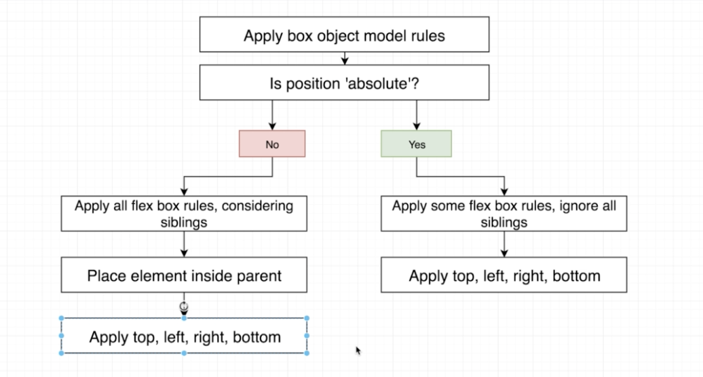

#### Layout system in ReactNative.

#### 1. Box-model

    like box-model in web browser but using some shortcuts.

    ```

    const styles = StyleSheet.create({
        view: {
        borderWidth: 1,
        borderColor: "black",
        },
        text: {
        borderWidth: 5,
        borderColor: "red",
        // marginVertical: 20,
        // marginHorizontal: 20,
        margin: 20,
        },
    });

    ```

#### 2. Flex

    Parent :

    - alignItem : 'stretch' -> default
    - justifyContent: 'flex-start' -> default
    - flexDirection: 'column' -> default

    Child :

    - flex: <grow> <shrink> <basis>
    - alignSelf: set to overwrite on parent alignItem

#### 3. Position



    absolute / relative

    - if using position absolute 'align' properties are ignore.

    - we can using top/bottom/left/right without set positon it will be position current position relative to closer element.

    - filled parent-view with '...StyleSheet.absoluteFillObject'

    ```
    styles: {
        flex: 1,
        borderWidth: 10,
        borderColor: "green",
        ...StyleSheet.absoluteFillObject,
    }
    ```
